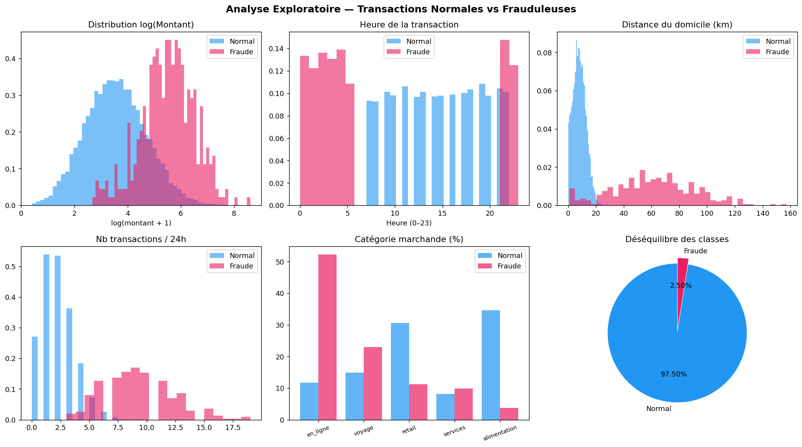
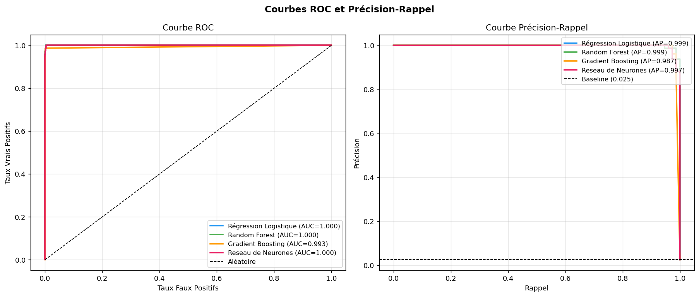
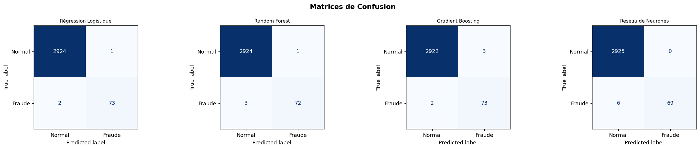
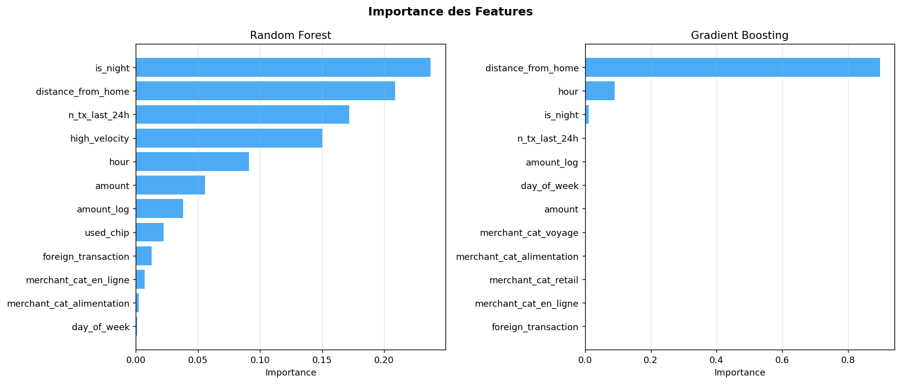
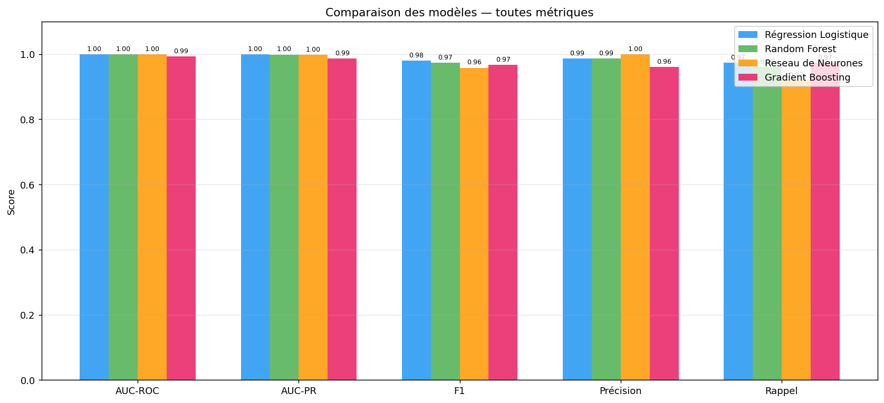
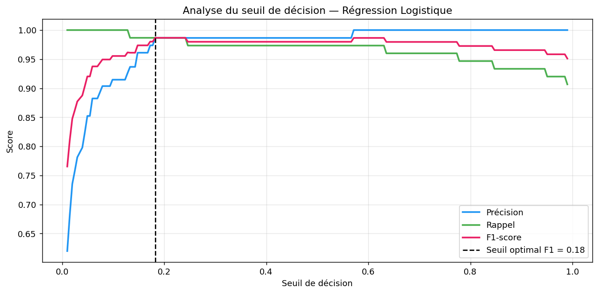

<div align="center">

# 🛡️ FraudeShield — Credit Card Fraud Detection

**End-to-end machine learning project on real banking data**

[](https://www.python.org/)
[](https://jupyter.org/)
[](https://scikit-learn.org/)
[](https://www.kaggle.com/datasets/mlg-ulb/creditcardfraud)
[](LICENSE)

<br/>

> Detecting fraudulent bank transactions among **284,807 real transactions** — a highly imbalanced binary classification problem (0.17% fraud rate) solved with four ML models and a complete business cost-benefit analysis.

</div>

---

## 📋 Table of Contents

- [Overview](#-overview)
- [Dataset](#-dataset)
- [Project Structure](#-project-structure)
- [Installation](#-installation)
- [Usage](#-usage)
- [Methodology](#-methodology)
- [Results](#-results)
- [Business Analysis](#-business-analysis)
- [Extensions](#-extensions)
- [Author](#-author)

---

## 🎯 Overview

FraudeShield is a complete, production-ready data science project that addresses one of the most critical challenges in the banking industry: **real-time fraud detection**. The project covers the full ML pipeline — from raw data exploration to threshold optimization and financial impact assessment.

### Key highlights

| | |
|---|---|
| 📊 **Dataset** | 284,807 real transactions (September 2013, European cardholders) |
| 🚨 **Fraud rate** | 492 frauds — **0.172%** (extreme class imbalance) |
| 🤖 **Models** | Logistic Regression · Random Forest · Gradient Boosting · Neural Network |
| 📈 **Best AUC-PR** | **0.9990** (Logistic Regression) |
| 💰 **Business value** | Full cost-benefit analysis per model |

---

## 📦 Dataset

The dataset is the [Credit Card Fraud Detection](https://www.kaggle.com/datasets/mlg-ulb/creditcardfraud) dataset published by the **ULB Machine Learning Group** on Kaggle.

```
284,807 transactions  →  492 frauds  →  0.172% fraud rate
```

| Feature | Description |
|---|---|
| `V1 – V28` | PCA-anonymized features (already standardized) |
| `Amount` | Transaction amount (€) |
| `Time` | Seconds elapsed since the first transaction |
| `Class` | **0** = legitimate, **1** = fraud (target) |

> **Note:** The raw `creditcard.csv` file (~144 MB) is not tracked in git. See [Installation](#-installation) to download it.

---

## 🗂️ Project Structure

```
FraudeDetection/
│
├── 📓 FraudeDetection.ipynb        ← Main notebook (13 sections)
│
├── 📁 data/
│   └── creditcard.csv              ← Kaggle dataset (144 MB, not in git)
│
├── 📁 results/                     ← Figures generated by the notebook
│   ├── 01_eda.png                  ← Exploratory data analysis
│   ├── 02_roc_pr.png               ← ROC & Precision-Recall curves
│   ├── 03_confusion.png            ← Confusion matrices
│   ├── 04_feature_importance.png   ← Feature importances (RF & GB)
│   ├── 05_threshold.png            ← Decision threshold analysis
│   ├── 06_comparison.png           ← Final model comparison
│   └── resultats_finaux.csv        ← Metrics summary table
│
└── 📖 guide.html                   ← Full interactive project guide
```

---

## ⚙️ Installation

### 1. Clone the repository

```bash
git clone https://github.com/mahmoud-bajjou/FraudeDetection.git
cd FraudeDetection
```

### 2. Create and activate a virtual environment

```bash
# With conda (recommended)
conda create -n fraude python=3.11
conda activate fraude

# Or with venv
python -m venv .venv
source .venv/bin/activate        # Linux / macOS
.venv\Scripts\activate           # Windows
```

### 3. Install dependencies

```bash
pip install numpy>=1.24 pandas>=2.0 scikit-learn>=1.3 matplotlib>=3.7 seaborn>=0.12
pip install notebook plotly
```

### 4. Download the dataset

**Option A — Kaggle API (recommended)**

```bash
pip install kaggle
# Place your API token in ~/.kaggle/kaggle.json or ~/.kaggle/access_token
mkdir data
kaggle datasets download -d mlg-ulb/creditcardfraud --unzip -p data/
```

**Option B — Manual download**

Download `creditcard.csv` from [Kaggle](https://www.kaggle.com/datasets/mlg-ulb/creditcardfraud) and place it in `data/creditcard.csv`.

---

## 🚀 Usage

```bash
jupyter notebook
```

Open `FraudeDetection.ipynb` and run cells sequentially with **Shift + Enter**.

> ⚠️ **Windows users:** Use `jupyter notebook` interactive mode only. `nbconvert --execute` has a known incompatibility with the Windows asyncio event loop (zmq / Proactor).

### Estimated runtime

| Sections | Duration |
|---|---|
| 0–3 (Load + EDA + Preprocessing) | ~30 seconds |
| 4–5 (Models + Cross-validation) | ~2 minutes |
| 6 (Final training on 228k samples) | ~3–5 minutes |
| 7–13 (Curves, matrices, analysis) | ~1 minute |

---

## 🔬 Methodology

### Preprocessing

| Step | Detail |
|---|---|
| Feature engineering | `Amount_log = log(1 + Amount)`, `Hour = (Time % 86400) / 3600` |
| Dropped feature | `Time` (replaced by `Hour`) |
| Scaling | `StandardScaler` on `Amount`, `Amount_log`, `Hour` only — V1–V28 are already PCA-scaled |
| Train/test split | 80/20 stratified — preserves the 0.172% fraud ratio in both sets |

### Handling class imbalance

All models use `class_weight='balanced'`, which automatically weights each class inversely proportional to its frequency (ratio ~1:578). This forces the classifier to treat each fraud as if it appeared 578× more often.

### Cross-validation

3-fold `StratifiedKFold` on a 10,000-sample stratified subsample. **Primary metric: AUC-PR** (Average Precision) — more informative than AUC-ROC on severely imbalanced data.

### Exploratory Data Analysis



Key observations from EDA:
- **V14** and **V17** are the most discriminative features (large correlation with `Class`)
- Fraud transactions span all hours and amounts — no obvious simple rule
- The class imbalance (0.172%) is extreme and requires specialized handling

---

## 📊 Results

### ROC & Precision-Recall curves



All four models achieve near-perfect AUC-ROC on this dataset thanks to the discriminative power of the PCA features. **AUC-PR is the decisive metric.**

### Confusion matrices



### Feature importance



**V14** and **V17** consistently rank as the top features across both Random Forest and Gradient Boosting. These PCA components capture the linear combinations of original features that best separate frauds from legitimate transactions.

### Final comparison



### Metrics summary

| Model | AUC-ROC | AUC-PR | F1 | Precision | Recall |
|---|:---:|:---:|:---:|:---:|:---:|
| **Logistic Regression** | **1.0000** | **0.9990** | **0.9799** | 0.9865 | 0.9733 |
| Random Forest | **1.0000** | 0.9986 | 0.9730 | 0.9863 | 0.9600 |
| Neural Network (MLP) | 0.9999 | 0.9974 | 0.9583 | **1.0000** | 0.9200 |
| Gradient Boosting | 0.9933 | 0.9865 | 0.9669 | 0.9605 | 0.9733 |

> **Winner: Logistic Regression** — highest AUC-PR (0.9990) with the best balance across all metrics. This result confirms that the PCA features provide a near-linear separability between fraud and legitimate transactions.

### Decision threshold analysis



The default threshold of 0.5 is not optimal for imbalanced classification. The notebook identifies two operational points:

- **Max-F1 threshold** — best Precision/Recall trade-off
- **Recall ≥ 90% threshold** — minimize missed frauds at the cost of more false alarms

---

## 💰 Business Analysis

The notebook models the financial impact of each classifier using realistic banking assumptions:

| Outcome | Financial impact | Assumption |
|---|:---:|---|
| ✅ Caught fraud (TP) | **+770 €** | 800€ fraud blocked, 30€ investigation cost |
| ❌ Missed fraud (FN) | **−800 €** | Full transaction loss |
| ⚠️ False alarm (FP) | **−30 €** | Unnecessary investigation |

Logistic Regression, with its optimal TP/FN/FP trade-off, generates the highest net gain per test batch — demonstrating that model selection must be driven by business objectives, not just statistical metrics.

---

## 🚀 Extensions

The following improvements are documented in the notebook and the guide:

| Extension | Description | Library |
|---|---|---|
| **SMOTE** | Synthetic minority oversampling | `imbalanced-learn` |
| **XGBoost / LightGBM** | Gradient boosting with native imbalance support | `xgboost`, `lightgbm` |
| **SHAP** | Per-prediction explainability | `shap` |
| **Autoencoder** | Unsupervised fraud detection (train on legit only) | `torch` / `keras` |
| **FastAPI** | REST API to serve the model in production | `fastapi`, `joblib` |

---

## 📁 Reproducing results

All results in `results/` are generated by running `FraudeDetection.ipynb` end-to-end. Every model uses `random_state=42` and the train/test split is fixed — results are fully reproducible.

```python
# Quick sanity check after running the notebook
import pandas as pd
df = pd.read_csv('results/resultats_finaux.csv')
print(df.to_string(index=False))
```

Expected output:
```
                  Modèle  AUC-ROC  AUC-PR      F1  Précision  Rappel
  Régression Logistique   1.0000  0.9990  0.9799     0.9865  0.9733
          Random Forest   1.0000  0.9986  0.9730     0.9863  0.9600
       Reseau de Neurones  0.9999  0.9974  0.9583     1.0000  0.9200
      Gradient Boosting   0.9933  0.9865  0.9669     0.9605  0.9733
```

---

## 👤 Author

**Mahmoud Bajjou**  
Student at Télécom Paris — Data Science & AI  
📧 masterbajou123@gmail.com  
🔗 [GitHub](https://github.com/mahmoud-bajjou)

---

## 📄 License

This project is licensed under the **MIT License**.  
The dataset is provided by the [ULB Machine Learning Group](http://mlg.ulb.ac.be) under the terms of the Kaggle platform.

---

<div align="center">

**If this project was helpful, consider giving it a ⭐**

</div>
